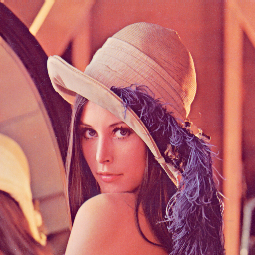

# Simple BMP image processing

> This is a C++ library to process BMP file

supported functions are:

1. **basic usages**:

  - load and save images(color and grayscale)

  - convert to grayscale

  - RGBtoYUV and reverse

  - rearrange pixel value

2. **simple manipulate usages**:

  - make biary image

  - erosion and delation

  - opening and closing

3. **simple transform**:

  - translate
  - scale
  - rotate
  - shear
  - mirror

4. **simple enhancement usages**:

  - logarithmic enahancement
  - histogram equalization
  - image mean filter
  - laplacian enha
  - standard biletral filtering

## basic usage

see `example/example_basic_processing.cpp` for how to use

## simple manipulation

### make binary

寻找合适的threhold


### delation


### erosion


### closing


### opening


### logarithmic enahancement


### histogram equalization


### rotate


### scale


#### mirror




### shear


#### mean filter

通过调用

```c++
image.make_mean_filter(2,2);
```


mean filter using a (2_2+1)_(2_2+1)=5_% window

#### laplapcian enhancement

window size 3*3


window size 5*5


re-sum with the original image with a wight of 0.2


##### mean filter

by calling

```c++
image.make_bilateral_filter(3,10);
```


