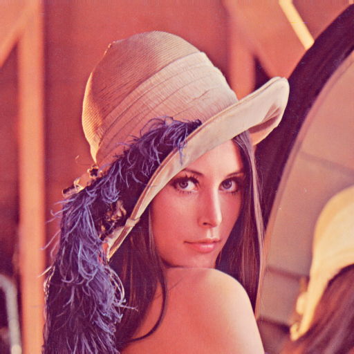

# 图像信息处理报告
> 陆家林 3140102299

## 主要做的东西

书写了一个BMPcontainer的类。支持一下功能

* 读取bmp
* bmp文件写入
* bmp由RGB转YUV
* 指定channel将其改为灰度图
* rearrange 颜色区间
* 写入灰度图
* 改变Y值
* YUV转化为RGB
* 写入彩色图

__类的构造：匈牙利法的函数为只读参数，驼峰法的函数为可修改内部值。__

	class BMPcontainer{
	private:
	BITMAPFILEHEADER fileHeader;
	BITMAPINFOHEADER infoHeader;
	std::vector<Pixel> pixels;
	std::vector<CPixel> cpixels;
	std::vector<COLORPLATTE> colorPlatte;
	std::string fileName;
	public:
	// constructor : load file
	BMPcontainer(std::string filename);
	// constructor : created by pixels information
	BMPcontainer(DWORD width,DWORD height,std::vector<CPixel> v);
	~BMPcontainer();
	// set pixel color by color template index
	void set_pixel_color(DWORD position,WORD postion);
	// set pixel color by color
	void set_pixel_color(DWORD position,WORD channel1,WORD channel2,WORD channel3);
	// save file
	bool save_as(std::string);
	// cout the info header
	void show_info_header();
	// cout the file headerj
	void show_file_header();
	// get pixels for pixel manipulation
	std::vector<CPixel> get_pixels();
	int get_width(){ return (int)this->infoHeader.biWidth; }
	int get_height(){ return (int)this->infoHeader.biHeight; }
	// show the exact channel value of first 10 pixel
	void show_first_10_pixels();
	// convert from RGB to YUV
	void RGBtoYUV();
	// convert from YUV to RGB
	void YUVtoRGB();
	// convert  to Gray scale by index of the desired channel
	void ToGray(int channel);
	// remap pixel value to 0-255
	void RearrangeIntensity();
	};

## 读取bmp文件

带有colorTemplate以及不带有的bmp都可以实现。

封装借口为

	auto image = BMPcontainer("test_image/lena512color.bmp");

## bmp文件写入

保存接口为
​		
       image.save_as("test_image/lena_save_test.bmp");

其中image为一个BMPcontainer类的实例。`save_as`的参数为文件存储路径及名称。

此为原图 lena

此为写入保存图

## bmp由RGB转YUV 及转回

BMPcontainer 类带有可直接使用函数

	image.RGBtoYUV();
	image.save_as("test_image/YUV.bmp");

此为将Y值改到BMP的蓝色通道中。

	image.YUVtoRGB();
	image.save_as("test_image/YUVtoRGB.bmp");
## 指定channel将其改为灰度图

	image.ToGray(0);
	image.save_as("test_image/gray.bmp");

`ToGray()`的参数为制定将要做为灰度值的channel 的索引。

测试结果如下

## rearrange 颜色区间
	image.RearrangeIntensity();
	image.save_as("test_image/rearrange.bmp");

 

可见图像更为锐利。

## 写入灰度图
已实现并展现在上面的例子里。

不过我还写了另一个构造BMPcontainer实例的方法，即直接搞定每个像素值传进去。

例如我写一个灰度为100的256*256的图。

	std::vector<CPixel> pix_now(256*256);
	for(int i=0;i<256;i++)
		for(int j=0;j<256;j++)
		{
			CPixel temp_pix={ 100,100,100,0 };
			pix_now.push_back(temp_pix);
		}
	image = BMPcontainer(256,256,pix_now);
	image.save_as("test_image/write_gray.bmp");

 

## 改变Y值，写入彩色图
这个其实和上面的写入是一样的。既然支持写入任意的像素。那么直接传入一个像素数组即可

例如写一个全蓝的256*256的图

	pix_now.clear();
	for(int i=0;i<256;i++)
		for(int j=0;j<256;j++)
		{
			CPixel temp_pix={ 255,0,0,0 };
			pix_now.push_back(temp_pix);
		}
	image = BMPcontainer(256,256,pix_now);
	image.save_as("test_image/write_color.bmp");

so easy!!!!

## YUV转化为RGB
	image.RGBtoYUV();
	image.save_as("test_image/YUV.bmp");
	std::vector<CPixel> pix = image.get_pixels();
	image.show_first_10_pixels();
	
	image.YUVtoRGB();
	image.save_as("test_image/YUVtoRGB.bmp");
	image.show_first_10_pixels();
	
	image.RGBtoYUV();

随意转换。
注意YUV与RGB的转换，因为数值表示的关系会失真。但这也无法避免.

